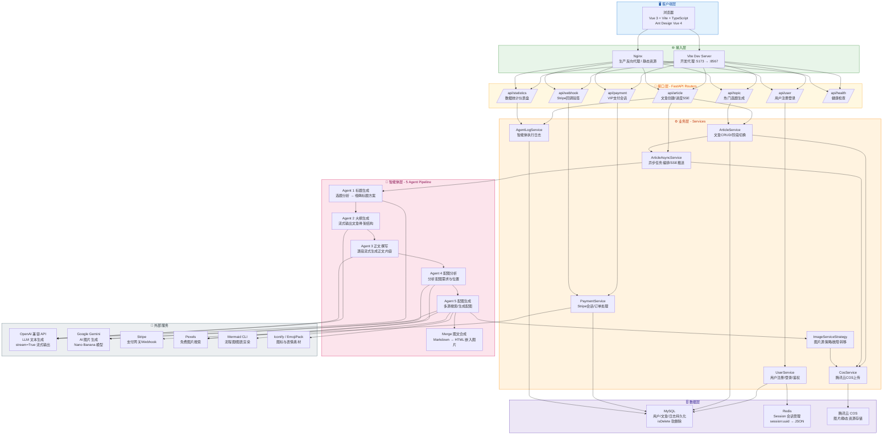

# 墨文 (mo-wen)

AI 爆款文章创作器 — 输入选题，自动生成结构完整、配图丰富的长文。

## 技术栈

| 层级 | 技术 |
|------|------|
| 后端框架 | FastAPI (Python 3.10+) |
| 前端框架 | Vue 3 + Vite + TypeScript |
| 数据库 | MySQL |
| 缓存/会话 | Redis |
| 支付 | Stripe |
| 对象存储 | 腾讯云 COS |
| AI 模型 | OpenAI 兼容 API / Google Gemini |
| 包管理 | uv (Python) / npm (Node) |

## 目录结构

```
mo-wen/
├── python-backend/          # FastAPI 后端
│   ├── app/
│   │   ├── agent/           # AI Agent 上下文与流处理器
│   │   ├── constants/       # Prompt 模板、常量
│   │   ├── managers/        # SSE 管理器
│   │   ├── models/          # ORM 模型、枚举
│   │   ├── routers/         # API 路由
│   │   ├── schemas/         # Pydantic 请求/响应模型
│   │   ├── services/        # 业务逻辑 + AI Agent
│   │   ├── utils/           # 工具函数
│   │   ├── config.py        # 配置（.env 读取）
│   │   ├── database.py      # 数据库连接
│   │   ├── deps.py          # 依赖注入（认证链）
│   │   ├── exceptions.py    # 异常体系
│   │   └── main.py          # 应用入口
│   ├── pyproject.toml
│   └── uv.lock
├── vue-frontend/            # Vue 3 前端
│   └── src/
│       ├── api/             # 自动生成的 API 客户端（OpenAPI→TS）
│       ├── components/      # 通用组件
│       ├── composables/     # 组合式函数
│       ├── constants/       # 常量
│       ├── layouts/         # 布局组件
│       ├── pages/           # 页面组件
│       ├── router/          # 路由配置 + 权限守卫
│       ├── stores/          # Pinia 状态管理
│       ├── utils/           # 工具函数（SSE、Markdown 等）
│       ├── access.ts        # 首次加载用户信息
│       └── request.ts       # Axios 实例
└── sql/                     # 数据库迁移脚本
```

## 后端技术架构

### 请求处理链路

```
Route Handler → Service（new 创建）→ raw SQL（databases 库）
                     ↑
              Database（Depends 注入）
```

- SQLAlchemy 仅用于 ORM 模型定义，查询使用 `databases.Database` 异步执行原始 SQL
- Service 在路由处理函数中直接 `new`，不走 FastAPI DI 容器

### 认证体系

```
Cookie(session_id) → get_session_id → get_current_user → require_login → require_admin
```

- 无 JWT，Cookie + Redis 存储会话
- 登录成功在 Redis 写入 `session:{uuid}` → `LoginUserVO` JSON
- 支持可选登录和强制登录两级

### 错误处理

- 所有错误统一返回 HTTP 200，通过 `code` 字段区分
- `BusinessException` + `ErrorCode` 枚举
- `throw_if(condition, ErrorCode, msg)` 守卫式断言
- 响应格式: `{ code: int, data: T | null, message: string }`

### 文章生成流水线（5 Agent）

```
Phase 1: 标题生成    → Agent 1（选题分析 + 标题方案）
         用户确认标题 → POST /confirm-title
Phase 2: 大纲生成    → Agent 2（流式输出大纲结构）
         用户确认大纲 → POST /confirm-outline
Phase 3: 正文+配图  → Agent 3（流式输出正文）
                    → Agent 4（分析配图需求）
                    → Agent 5（多源配图生成）
                    → Merge（图文合成）
```

关键技术点：
- **异步编排**: `asyncio.create_task()` 启动每阶段，不阻塞请求
- **SSE 推送**: `SseEmitterManager` 维护 `asyncio.Queue` 字典，按 taskId 隔离
- **流式输出**: Agent 2/3 调用 OpenAI 兼容 API `stream=True`，逐 chunk 通过 SSE 推送
- **进度通信**: 前端 `EventSource` 或 `fetch + ReadableStream` 监听 `/api/article/progress/{taskId}`
- **图片策略**: `ImageServiceStrategy` 插件化，7 个源（Pexels/Gemini/Mermaid/Iconify/Emoji/SVG/Picsum），Failover 兜底

### 支付流程

```
创建会话 → Stripe Checkout → 用户支付 → Webhook 验签 → 更新用户 VIP 状态
```

VIP 档位: 月付 ¥9.90 / 年付 ¥99.00 / 永久 ¥199.00

## 前端技术架构

### 路由与权限

```
createWebHistory → access.ts（首次获取用户）→ 路由守卫（/admin/* 拦截）
```

- `api/` 目录代码由 OpenAPI 规范自动生成（`npm run openapi2ts`）
- Axios 实例配置 `withCredentials: true`，自动携带 Cookie

### 状态管理策略

- **Pinia**: 仅存储跨页面共享的登录用户状态
- **页面级状态**: 使用 Vue 3 `ref`/`reactive`，保持组件自治
- 无全局 store 膨胀

### 文章创作页（三栏布局）

```
┌──────────┬──────────────────────┬──────────┐
│ LeftPanel│    CenterPanel       │RightPanel│
│          │                      │          │
│ Pipeline │ TopicForm → Title    │  Stats   │
│ Status   │ Selector → Outline   │  Tips    │
│ Steps    │ Editor → Content     │  Hot     │
│          │ Generator → Result   │  Topics  │
│          │                      │          │
└──────────┴──────────────────────┴──────────┘
  260px         1fr                280px
```

### SSE 通信方案

| 方案 | 文件 | 适用场景 |
|------|------|---------|
| `EventSource` | `utils/sse.ts` | 简单场景 |
| `fetch + ReadableStream` | `utils/sseFetch.ts` | 需要 AbortController 精确控制生命周期 |

### 自定义通知

- Toast（右上角）和 Message（顶部居中）通过 composables + `<Teleport>` 实现
- 不使用 ant-design 内置的 message/notification 组件，便于全局样式控制

### 组件体系

- 14 个通用组件（`GlobalHeader`, `GlobalFooter`, `PageHeader`, `Logo`, 基础表单控件等）
- 所有组件使用 `<script setup lang="ts">` 语法
- SCSS 样式，CSS 变量做主题切换

## 技术特点

**后端**
- 全异步（async/await + asyncio + databases）
- 统一错误码 + 统一响应格式
- 策略模式插件化图片来源
- SSE 流式进度推送，asyncio.Queue 解耦

**前端**
- OpenAPI 自动生成 TS 类型与 API 函数
- 三栏 CSS Grid 创作工作台
- fetch + ReadableStream SSE 支持 AbortController 精确控制
- Pinia 轻量化，页面状态自治
- 深浅主题切换（CSS 变量）

**工程化**
- uv + npm 双包管理
- Conventional Commits 规范
- SQL 迁移脚本独立管理
- 无 Docker/CI/测试框架，轻量开发

## 系统架构图



